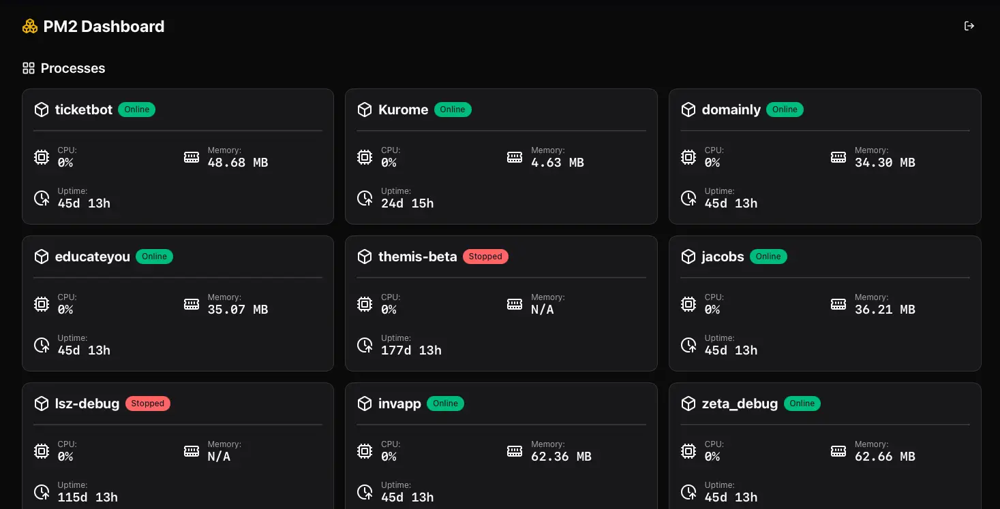
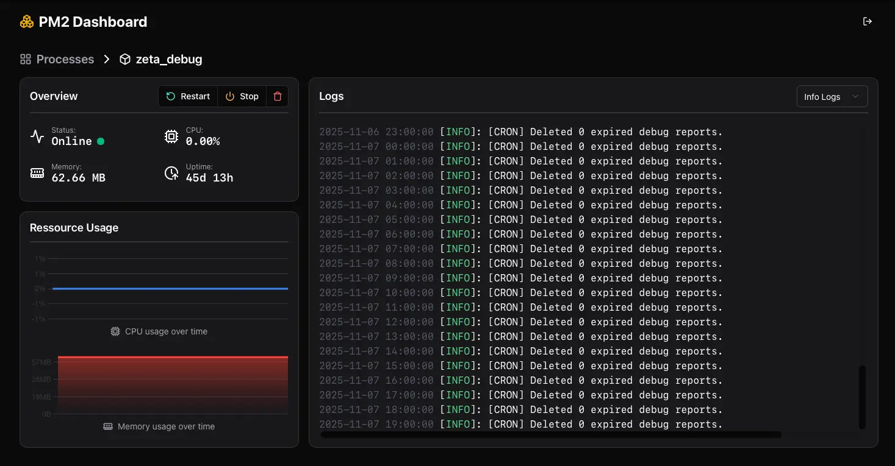
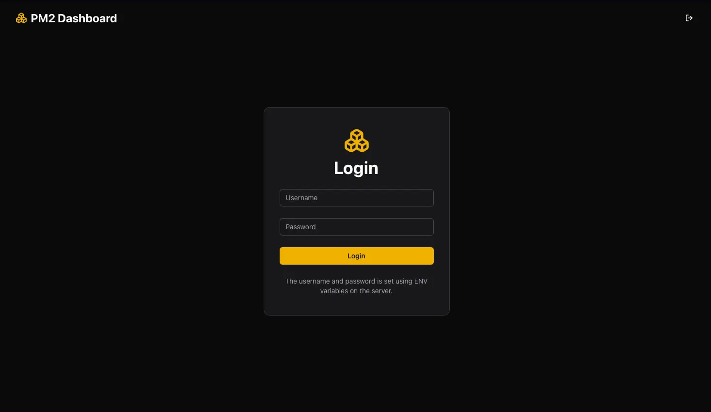

<p align="center">
  
  <h1 align="center"><b>PM2 Dashboard</b></h3>

  <p align="center" >A simple web dashboard for monitoring and managing pm2</p>
</p>

PM2 Dashboard is a lightweight, web-based interface for monitoring and managing processes running on your server using [PM2](https://pm2.keymetrics.io).

Deployment is simple as simple as it gets: Clone the repository, build the app, and start it. No external database or separate frontend/backend setup required.

The dashboard displays essential metrics and live logs, providing a clean and efficient overview of your server’s processes.

## Features

- Overview about all running processes
- Monitor memory and CPU usage
- Restart, stop or delete processes
- Realtime logs

## Screenshots

<table>
  <tr>
    <td>
      
    </td>
    <td>
      
    </td>
  </tr>
  <tr>
    <td>
      
    </td>
    <td>
    </td>
  </tr>
</table>

## Installation

> [!IMPORTANT]  
> The dashboard must run on the same system as pm2

1. Clone the repository

```bash
git clone https://github.com/KartoffelChipss/pm2-dashboard
```

2. Install dependencies & build

```bash
cd pm2-dashboard
pnpm install --frozen-lockfile
pnpm build
```

3. Create `.env` file

```bash
cat > .env <<'EOF'
CONFIG_PATH=./config
PORT=3000
USERNAME=username_change_this
PASSWORD=password_change_this
TOKEN_SECRET=dev_secret_change_this
EOF
```

3. Start using pm2

```bash
pm2 start "pnpm start" --name pm2-dashboard
```

## License

This project is licensed under the GNU Affero General Public License v3.0 (AGPL-3.0).  
See the [LICENSE](./LICENSE) file for details.

## Credits

This project uses [Lucide Icons](https://lucide.dev) licensed under the [ISC License](https://github.com/lucide-icons/lucide/blob/main/LICENSE).

© Lucide Contributors
